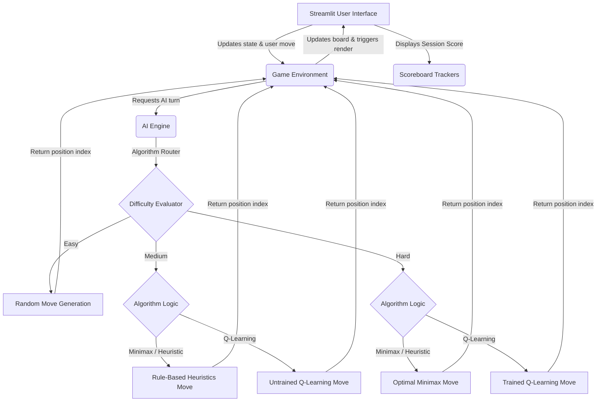

# AI-Powered Tic-Tac-Toe Game Decision System

This complete codebase provides a Tic-Tac-Toe Game Decision System featuring a Streamlit web interface and a robust AI engine capable of employing varying tactical algorithms. The implementation rigorously follows Python design principles and project constraints.

## Streamlit cloud link
[streamlit_app](https://gamedecisionsys.streamlit.app/)


## Demo 


## Project Execution Instructions

1. **Prerequisite:** Ensure you have Python 3.10 explicitly installed on your system.
2. **Setup Environment:** Use the detailed terminal commands below to prepare your environment.

### Terminal Commands (Windows Command Prompt)

```bash
# 1. Create a virtual environment specifically with Python 3.10
python3.10 -m venv game_env

# 2. Activate the virtual environment
game_env\Scripts\activate

# 3. Install necessary project requirements
pip install -r requirements.txt

# 4. Launch the Streamlit application
streamlit run app.py
```

### Architectural Flowchart

This Mermaid.js flowchart details the interaction layer passing data between the Streamlit UI, Game Logic handler, and respective AI models.



## AI Approaches

* **Minimax:** A full-search algorithm returning an optimal play for every move sequentially by simulating a complete sub-game graph mapping out game-theoretical +10 and -10 scoring nodes.
* **Rule-Based Heuristics:** Employs logical human reasoning prioritizing a winning sequence first, blocking enemy wins second, occupying the superior center region, securing structural corners, and finalizing randomly.
* **Q-Learning:** Implements a dynamic Reinforcement Learning paradigm running 3000 rapid local simulation bouts against a random agent mapping the fundamental state space matrix Q-table rewards values enabling empirical decision making parameters.
